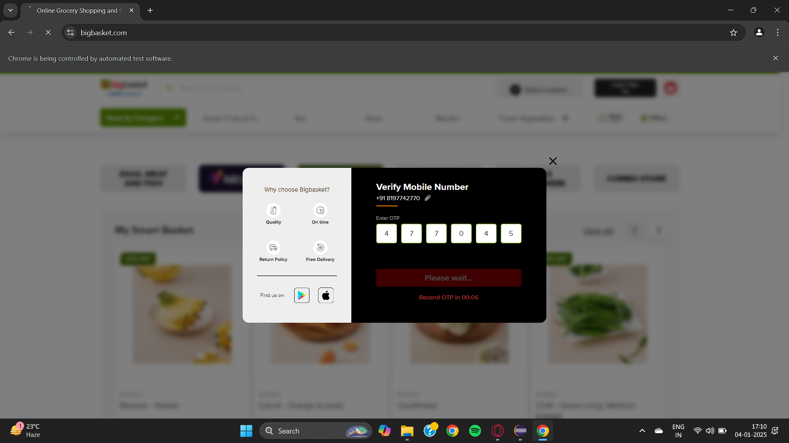

# 🛒 BigBasket Automation (Selenium + Java)

This project automates the login/signup and cart interaction flow on [BigBasket](https://www.bigbasket.com) using **Selenium WebDriver**.

---

## ✅ Features

- 📱 Phone number-based login with manual OTP entry  
- 🛒 Adds product to cart automatically  
- 📸 Captures screenshots of important steps (e.g., cart, signup)  
- 💡 Uses dynamic element locators and JavaScriptExecutor for complex elements  
- ⚙️ Graceful browser cleanup and error handling after execution

---

## 🛠 Tech Stack

- Java 17  
- Selenium WebDriver  
- ChromeDriver  
- Maven  
- Eclipse IDE

---

## ▶️ How to Run

> 🧪 This project is designed to run directly from Eclipse.

### Option 1: Run via Eclipse IDE
1. Open the project in Eclipse.
2. Click the run button
3. Enter OTP manually when prompted.
4. Screenshots will be saved in the `screenshots/` folder.

## Screenshots

